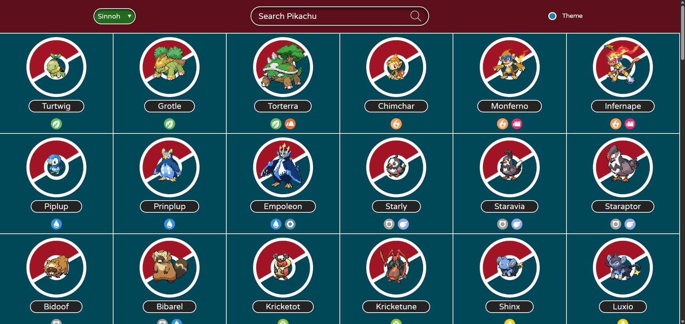
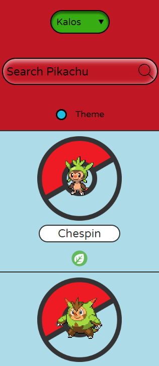
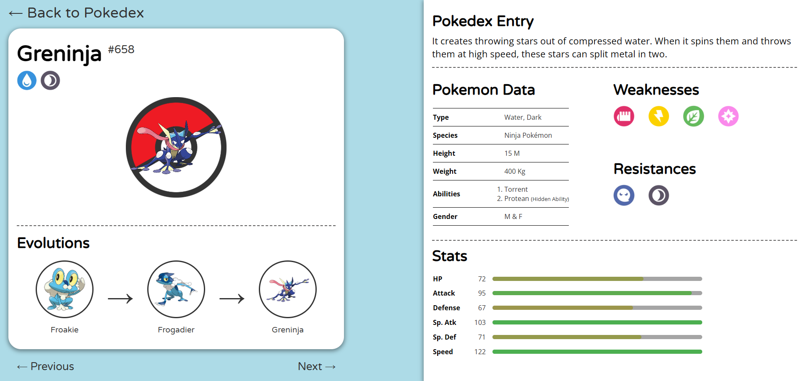
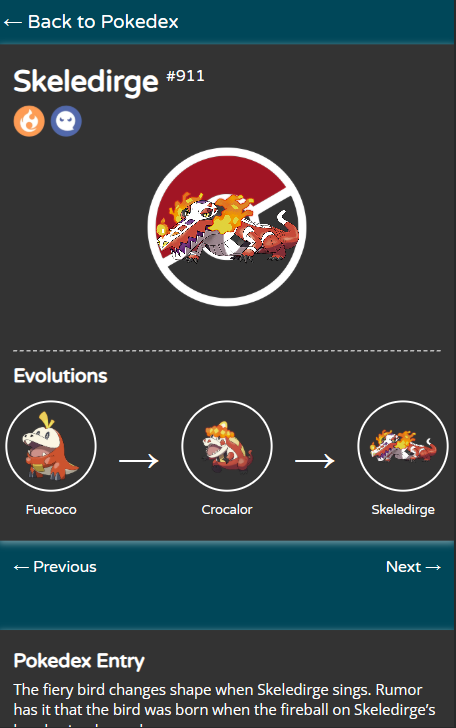

# Pokedex Website 2
[This website]() is an improved version of the pokedex website I built before.

## Improvements
- Dark/Light theme is more consistent, and is permanent via localStorage
- Fetching is more efficient, as its done by a back end (NodeJS)
- Utilizes a simple LRU cache
- Faster load speeds
- Responsive pages
- Redesigned both pages

## Screenshots
### Home page

### Entry page (Desktop)

## Web Technologies
- HTML
- CSS
- JS
- NodeJS

## Credits 
- [PokeAPI](https://pokeapi.co/)

